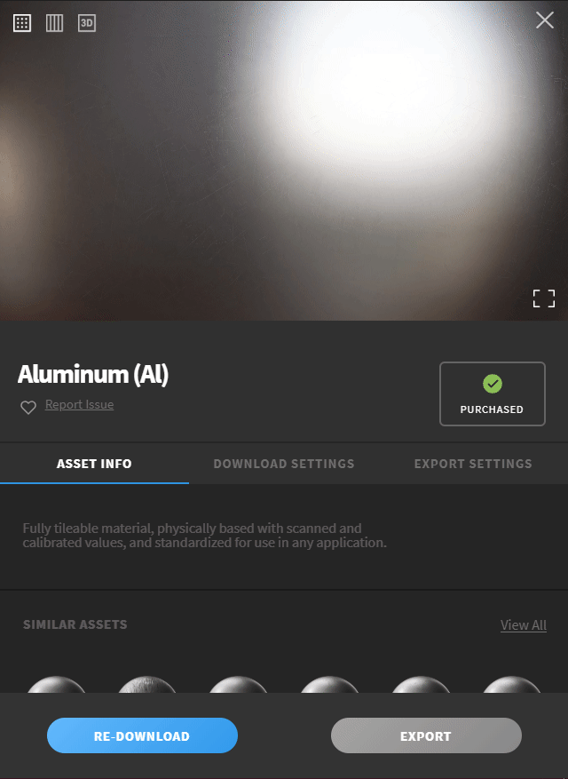
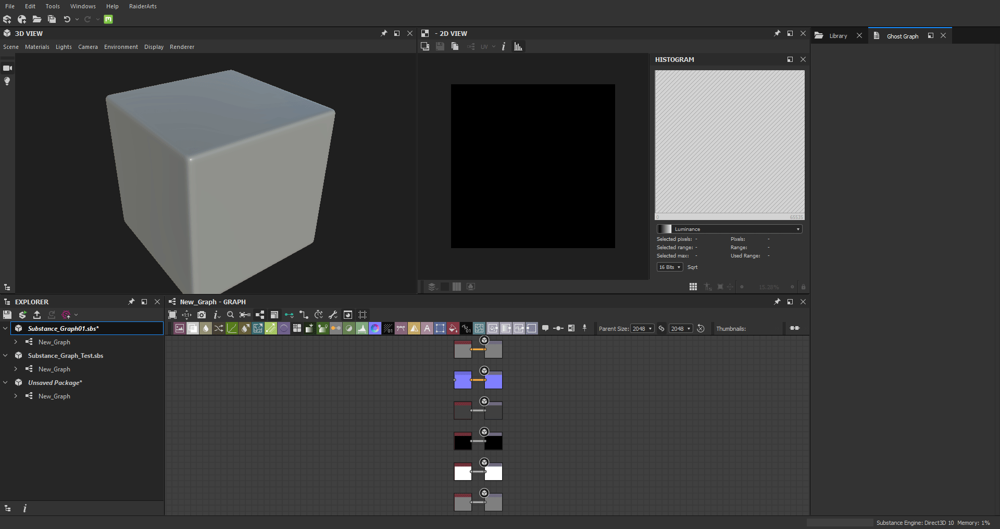

# Megascan Link Plugin    
This plugin enable the import of Megascan Assets using the export feature of [Quixel Bridge](https://quixel.com/bridge)

## Quick start guide

For a complete guide on all the options of the plugin refere to the [How to use documentation](http://todoaddlink).

 - Download the plugin from the [Release Page](https://github.com/Raider-Arts/megascan-link/releases) or the [Substance Share Platform](http://todoaddlink) (plugin currently in review state) or [build it yourself](https://megascan-link.readthedocs.io/en/latest/prerequisites.html)

 - Install it in Substance Designer using the Plugin manager, you can find it under ``Tools > Plugin Manager..`` then click ``install`` and navigate to the path were you previously downloaded it
 
    > :information_source: **Refere to the official doc for installing a [Plugin Package](https://docs.substance3d.com/sddoc/plugins-packages-182257045.html)**

 - Select a Megascan Asset you want to export then setup Quixel Bridge to the correct export option and then click Export (Default plugin port is **24981**)

    

 - Import the currently exporting Megascan Asset to the selected Substance Designer packages:

    

## Full Import Example
In this short video you can see how to import a Megascan Asset from Quixel Bridge to Substance Designer using the Plugin

## Want to contribute?
If you are willing to contribute you should start by [reading the dev docs](https://megascan-link.readthedocs.io/en/latest/).

**Done it?** all right it's time to clone this repository and start coding !!

After you made your changes don't forget to test them!! 

And please i'm trying to keep this plugin without any external dependencies for the ease of usage for everyone! so try to rely on what the already build-in python installation of Substance Designer has to offer

I hope this plugin helped you. 
