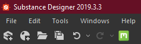
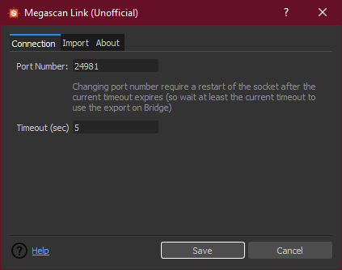
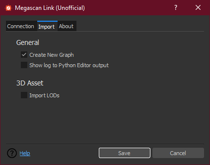

# How to use the plugin


## Download the plugin

You can find it in the [realease](https://github.com/Raider-Arts/megascan-link/releases) tab of the github project 

##### Build types
- Development Buid
    > This build is always updated as soon a commit is pushed on the master branch
    ```eval_rst
    .. warning::
        This builds can be very unstable or not working at all!
        So when use them expect them to not work or not behaving correctly
    ```

- Tagged Buils
    > The tagged builds are stable usable builds

## Install the plugin
Install it in Substance Designer using the Plugin manager, you can find it under ``Tools > Plugin Manager..`` then click ``install`` and navigate to the path were you previously downloaded it

```eval_rst
.. note::
    Refere to the official doc for installing a `Plugin Package <https://docs.substance3d.com/sddoc/plugins-packages-182257045.html>`_
```

## Use the Plugin
After you have installed the plugin go to **Quixel Bridge** select the **Megascan asset** you want to import on Substance Designer go to the **Export Setting** tab and select from the **Export To** drop down the **Custom Socket Export** option, then in the **Socket Port** insert the same port you have set up on the **Plugin Settings** (Default to **24891**) 

##### Bridge setup example


##### Substance designer import step
When presented the import dialog you can choose to wich packages import the Megascan assets by selecting them in the list (shift selection and ctrl selection are enabled) and then click import


## Plugin Settings
When you installed the plugin a new icon appeared in the Substance Designer main toolbar, that icon button opens the Plugin Settings dialog that can be used to change how the plugin works.


##### Connection settings
This tab allow to change the connection setting of the socket 

```eval_rst
.. warning:
    the port and timeout setting (if changed) will be applied after the next timeout frame 

    So if you changed port before using the Export option of Quixel bridge wait at least the timeout duration
```

 Option        | Description          | Default
 ------------- |-------------| -----
 Port Number      | the port number to listen, must be the same specified on the Custom Socket Export on Quixel Bridge |  24981 
 Timeout      | the number of seconds to wait before restarting the socket, try to use a small duration      |  5  



##### Import settings
This tab allow to change the import behaviour of the plugin 

 Option        | Description          | Default
 ------------- |-------------| -----
 Create New Graph      | whenever or not to create a new graph (with automatic outputs linking and bitmap importing) for each imported Megascan Asset |  True 
Show log To Python Editor output      | if set to True print the log in the Python Editor output. The log is by default written to the megascanlink.log file located in the root folder of plugin directory installation       |  False
Import LODs| whenever or not to import for 3D Assets also all the associated LODs files|  False

